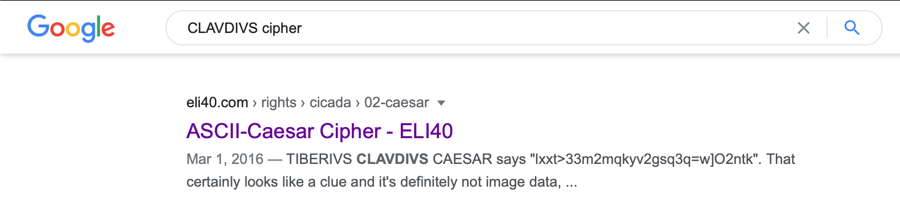
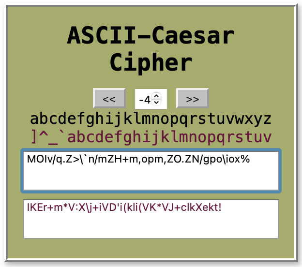
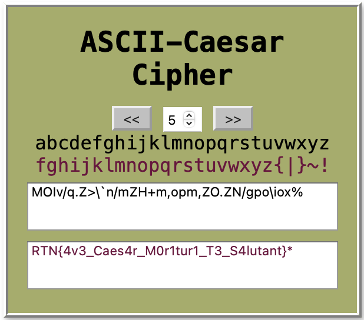

**clavdivs**
==========
**Tools used:** `Google`\
**Flag:** `RTN{4v3_Caes4r_M0r1tur1_T3_S4lutant}`\
**Challenge Points:** `100`\
**Challenge Message:**
```
AVE CLAVDIVS!
MOIv/q.Z>\`n/mZH+m,opm,ZO.ZN/gpo\iox%
```
**Let's get into it**
==========
First thing first we get a AVA CLAVDIVS and some weird random string.
Let's try googling `CLAVDIVS Cipher`



I found this interesting site so let us try?
Let's paste the given random text.



Mhmmm, How can we know the number if they didn't gave it to us?
We can increase or decrease the number till we get the flag or let's be a bigbrain for a second Kappa

In RTN Community there is 5 Staffs, so why not trying number 5?



Lol, worked XD\
the flag is `RTN{4v3_Caes4r_M0r1tur1_T3_S4lutant}`