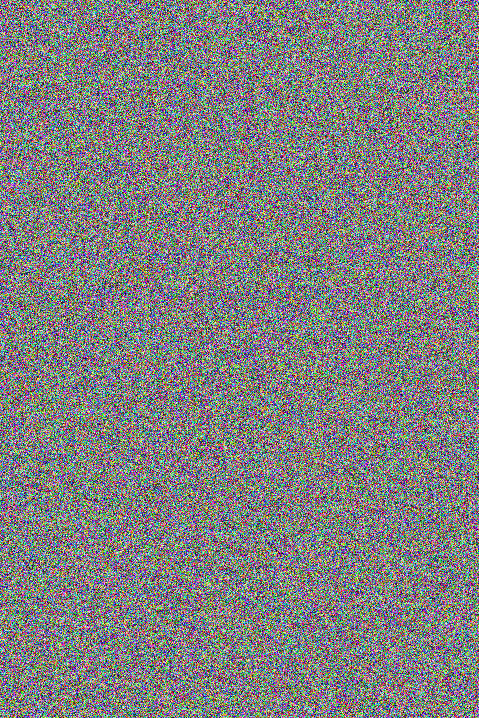
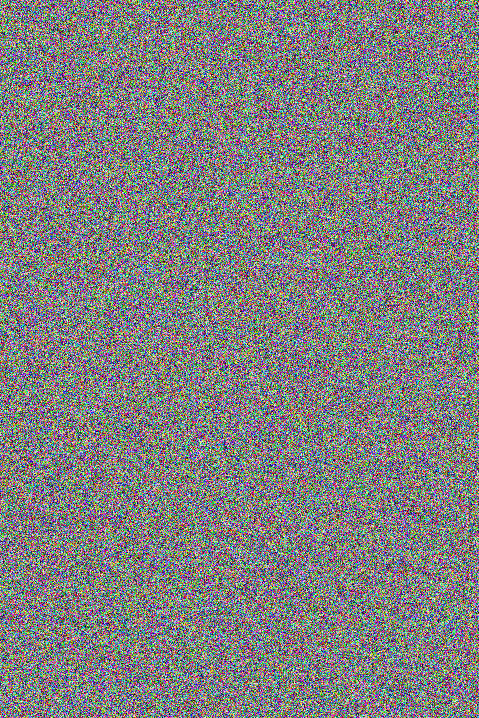
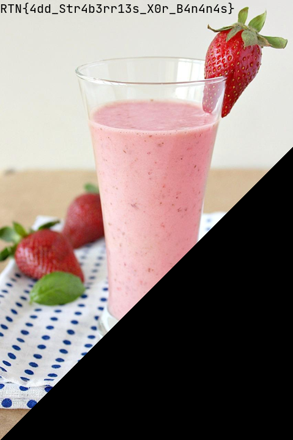

**mixitup**
==========
**Tools used:** `Python`\
**Flag:** `RTN{4dd_Str4b3rr13s_X0r_B4n4n4s}`\
**Challenge Points:** `200`\
**Challenge Message:**
```
We intercepted some secret pictures of which we believe
contains a prototype of our competitor's newest smoothie recipe.
It seems that they have mixed up more than just fruits eXclusively.
Can you help us finding out what they added?
```
We get two images in the challenge itself.



----




**Let's get into it**
==========

Most of this type of challenges are probably `xor'ed` pixels,
so first try i did on this challenge is to xor the pixels from first image to the second image using python.

Here is my script

```python
from PIL import Image

def mixitup():
	firstImage = Image.open("image1.bmp")
	secondImage = Image.open("image2.bmp")

	(width, height) = firstImage.size

	resultImage = Image.new( 'RGB', (width, height)) 
	resultImagePixels = resultImage.load()

	firstImagePixels = firstImage.load()
	secondImagePixels = secondImage.load()

	for width in range(0, width):
		for height in range(0, height):
			r = firstImagePixels[width, height][0] ^ secondImagePixels[width, height][0]
			g = firstImagePixels[width, height][1] ^ secondImagePixels[width, height][1]
			b = firstImagePixels[width, height][2] ^ secondImagePixels[width, height][2]
			resultImagePixels[width, height] = (r, g, b)

	return resultImage


mixitup().save("result.bmp", "bmp")
```



Here we go! `RTN{4dd_Str4b3rr13s_X0r_B4n4n4s}`
