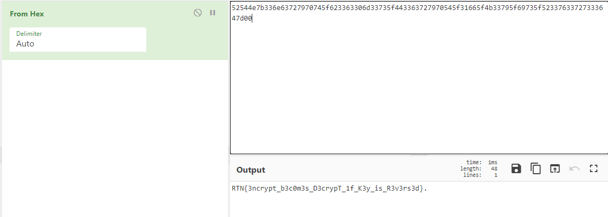

**rehasher**
==========
**Tools used:** `Python and CyberChef`\
**Flag:** `RTN{3ncrypt_b3c0m3s_D3crypT_1f_K3y_is_R3v3rs3d}`\
**Challenge Points:** `450`\
**Challenge Message:**
```
I wrote a new asymmetric encryption algorithm, and it is truly unbreakable!

Don't believe me? What if I told you I repeatedly hashed the input using SHA-256?

See you in fifty million years or so when you finally bruteforced my private key! >:)

Cipher text: 15e1c8c4bd2fcb12838d3f48e8fc567adf4fac1c36648eb270ad899a717dfadfccd9b49fc32a726711dd1d7faab7ed81
Public key: 537472347762337272795f536d303074686933535f42337374
```
And we get a python script

```python
import hashlib
import sys 
import math

BLOCK_SIZE = 16

def encrypt(plain_text, key):
    result = bytearray()

    padding_size = math.ceil(len(plain_text) / BLOCK_SIZE) * BLOCK_SIZE
    plain_text = plain_text.ljust(padding_size, b'\0')

    for i in range(0, len(plain_text), BLOCK_SIZE):
        result.extend(encrypt_block(plain_text[i:i+BLOCK_SIZE], key))

    return result

def encrypt_block(block, key):
    a = block[0:BLOCK_SIZE // 2]
    b = block[BLOCK_SIZE // 2:BLOCK_SIZE]

    for k in key:
        c = hashlib.sha256(b + bytes([k])).digest()[0:BLOCK_SIZE // 2]
        print(c)
        a, b = b, bytes(x ^ y for x, y in zip(c, a))

    return b + a

if __name__ == "__main__":
    if len(sys.argv) <= 1:
        print(f"Usage {sys.argv[0]} <plain_text> <public_key>")
        sys.exit(0)

    p = bytes.fromhex(sys.argv[1])
    k = bytes.fromhex(sys.argv[2])

    encrypted = encrypt(p, k)
    print(encrypted.hex())
```

**Let's get into it**
==========
Alright, so this script does take our input and turn it into block and hash it using `sha-256` multiple times,
then gives us the result hash.\
So is it possible to get our flag back? The answer is `Yes`
How? Its easy and simple just reverse the key by editing python code in `encrypt_block` function.

Change `for k in key:` to `for k in key[::-1]:`\
Now we run the script by using this command
```
python3 script.py 15e1c8c4bd2fcb12838d3f48e8fc567adf4fac1c36648eb270ad899a717dfadfccd9b49fc32a726711dd1d7faab7ed81 537472347762337272795f536d303074686933535f42337374
```

Now we do get this output `52544e7b336e63727970745f623363306d33735f443363727970545f31665f4b33795f69735f52337633727333647d00`\
Lets use `CyberChef` to convert it to ascii



Here we go! the flag is `RTN{3ncrypt_b3c0m3s_D3crypT_1f_K3y_is_R3v3rs3d}`