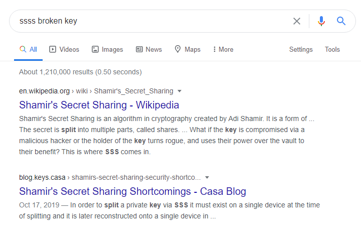
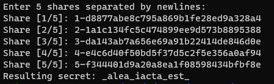
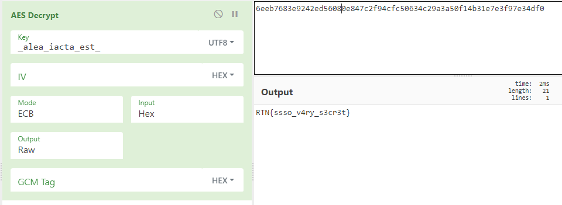

**ssssecret**
==========
**Tools used:** `Google, WSL and CyberChef`\
**Flag:** `RTN{ssso_v4ry_s3cr3t}`\
**Challenge Points:** `400`\
**Challenge Message:**
```
I want to share a secret,
A secret dear to me.
But the secret to keeping a secret
Is to never give out the key.

So I broke it up in little pieces
As small as they can be.
Then after that you wouldn't expect
I handed them out for free.

Follow up these pieces
Understand them to a degree
At the very root of it all
The answer you will see

AES-ECB('6eeb7683e9242ed56080e847c2f94cfc50634c29a3a50f14b31e7e3f97e34df0', key)

(1, d8877abe8c795a869b1fe28ed9a328a4)
(2, 1a1c134fc5c474899ee9d573b8895388)
(3, da143ab7a656e69a91b22414de846d0e)
(4, e4c6d40f50bd5f37d5c2f5e356a0af94)
(5, f344401d9a20a8ea1f08598434bfbf8e)
```
**Let's get into it**
==========

To be honest this one took quite a long time to understand the poem in this message,
As we can see the flag is encrypted with `AES` but the key is broken as the poem says.

How can we fix the key? Let's look at the challenge name `ssssecret` why is there 4 `s`'s in the name?
Let's google `ssss broken key` and see what do we get!



Alright, first few results are about `Shamir's Secret Sharing` let's install it and try it, by using this command.

```bash
sudo apt install ssss
```

Ok, lets try to fix the key by using ssss combine with this command.

```bash
ssss-combine -t 5 -D
```

Why did we choose number 5? because there is 5 threshold.



So here we go! we got the key which is `_alea_iacta_est_` let's try to decrypt the flag using `CyberChef`
by selecting `AES Decrypt and ECB Mode`



Here we go! we got the flag `RTN{ssso_v4ry_s3cr3t}`