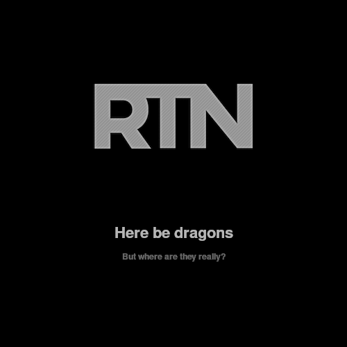
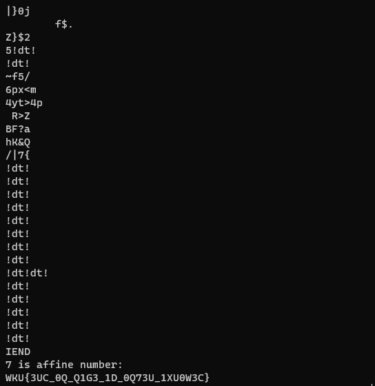
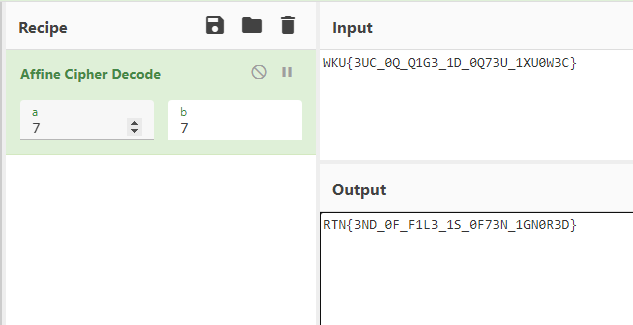

**Dragons**
==========
**Tools used:** `WSL and CyberChef`\
**Flag:** `RTN{3ND_0F_F1L3_1S_0F73N_1GN0R3D}`\
**Challenge Points:** `150`\
**Challenge Message:**
```
Here at RTN be dragons. But were are they really?
```


**Let's get into it**
==========
Its an image file nothing really interesting in it, so what i did is,
I used `strings <file>` on the image using `WSL` and i got something interesting as you can see

```
command: strings image.png
```



as you can see we got `7 is affine number:` and `WKU{3UC_0Q_Q1G3_1D_0Q73U_1XU0W3C}`
which means it uses Affine Cipher as it says lets use `https://gchq.github.io/CyberChef`
to Decode the text



and we got the flag `RTN{3ND_0F_F1L3_1S_0F73N_1GN0R3D}`