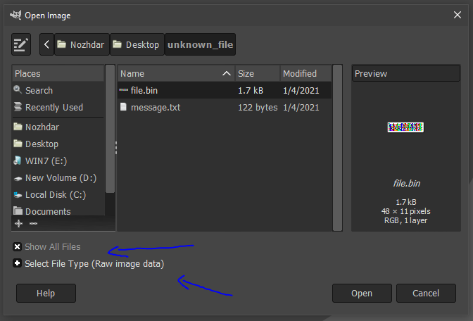
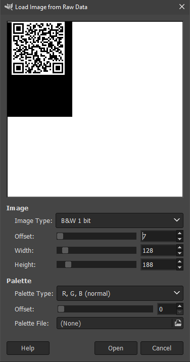
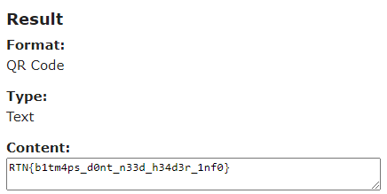

**unknown_file**
==========
**Tools used:** `GIMP`\
**Flag:** `RTN{b1tm4ps_d0nt_n33d_h34d3r_1nf0}`\
**Challenge Points:** `300`\
**Challenge Message:** 
```
I don't really know what to make of this file.
I wish there was a way to visualize it,
but all I see are blocks of data...
```

There is a hint in the message as you can see `I wish there was a way to visualize it`,
after reading this message i immediately thought of `GIMP` and gave it a chance! 

Open `GIMP` and from `File -> Open` and Select `Row Image Data` also make sure to check on `Show all files`



By editing the `Image type, Offset, Width and Height` I finally got something interesting from it as you can see



Lets scan this `QR Code` using `https://www.onlinebarcodereader.com/`



Here we go! we got the flag `RTN{b1tm4ps_d0nt_n33d_h34d3r_1nf0}`