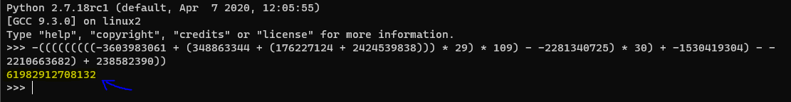

**matryoshka**
==========
**Tools used:** `Python`\
**Flag:** `RTN{z1p_th3_z1p_to_z1p_th3_z1p}`\
**Challenge Points:** `250`\
**Challenge Message:**
```
Today I downloaded the full blockchain for RTN COIN. This surely took up lots of space, so I compressed it!
Then I compressed it again! And again! And again! I compressed so many times,
I surely won't have to worry about space anymore! Every professional would approve.
```

**Let's get into it**
==========
In this challenge we get a file `code.txt` and `file.zip`, the zip file is protected with a password
and the password is in `code.txt`

code.txt : `-(((((((((-3603983061 + (348863344 + (176227124 + 2424539838))) * 29) * 109) - -2281340725) * 30) + -1530419304) - -2210663682) + 238582390))`

We need to calculate this to get our password so 
let's open python in `cmd` and paste this code there so we can get our password.



Okay hold on! we got another zip file and text file, and the message says `Then i compressed it again and again and again`, so in this challenge we probably gonna need to make a script to unzip all these files.

Let's use python!

```python
from zipfile import ZipFile

filename = 'file.zip'
password = 'code.txt'

for i in range(0, 101):
    with ZipFile(filename) as zf:
        with open(password) as f:
            zf.extractall(str(i), pwd = bytes(eval(f.readline())))
            filename = str(i) + '/file.zip'
            password = str(i) + '/code.txt'
```

Now save the code and run it by using `python unzip.py`, after running it we get a lot of directories being created in our folder,
After the script finish its job, open the last folder and we can see inside `flag.txt`.

Open the flag and here you go! `RTN{z1p_th3_z1p_to_z1p_th3_z1p}`