**webcat**
==========
**Tools used:** `WSL, CyberChef and C#`\
**Flag:** `RTN{R4ther_hav3_a_C4t_th4t_M30w5}`\
**Challenge Points:** `600`\
**Challenge Message:**
```
My cat is a true polyglot. He speaks over 80 languages, including the weird language of letni!
To showcase his brilliance, I set up a website that allows you to interact with him. Come and check it out:
http://smoothie.rtn-team.cc/
Be aware, he has a bit of an ego. He is very picky with whom he interacts with, and has a relatively short attention span. Be sure to say "hello" first and let him get accustomed to you!
```
**Let's get into it**
==========
Looks like an interesting cat, let's open the given link and check what is inside.

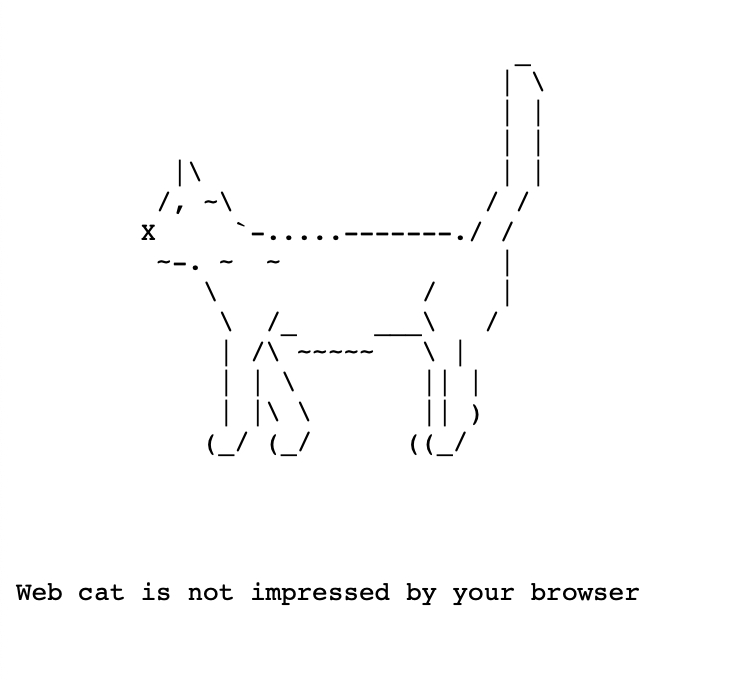

As we can see this cat is not impressed by our browser.

how can we make fix that? lets try another protocol maybe he doesn't like HTTP?
Let's try another way of connecting to it, maybe something like `nc` in `WSL`?

```
nc smoothie.rtn-team.cc 80
```

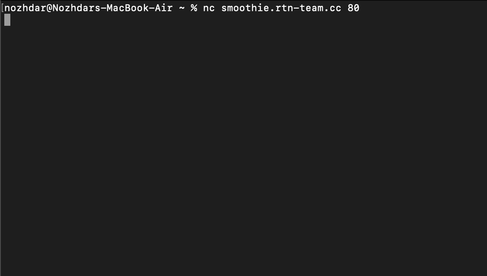

Ok, we didn't get that message again by the cat `Web cat is not impressed by your browser`,
Looks like we are getting there.

Now what are we gonna do? Let's look at the message once again.

```
Be aware, he has a bit of an ego.
He is very picky with whom he interacts with, 
and has a relatively short attention span. 
Be sure to say "hello" first and let him get accustomed to you!
```

So the cat has a big EGO Kappa, we need to say hello.\
Alright, let's give it a try.

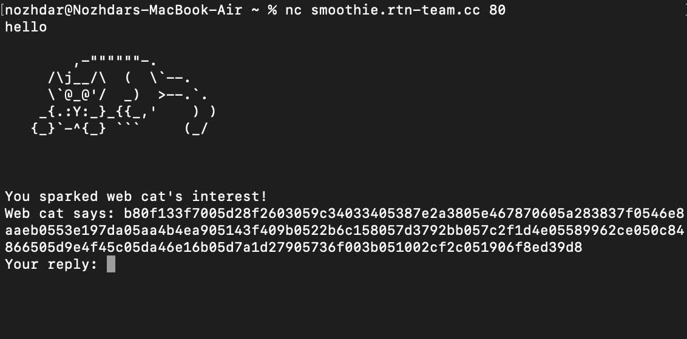

Ok we did it! But hold-on, what is that weird bytes we are getting?
Do we need to check the message again? i guess so.

`My cat is a true polyglot. He speaks over 80 languages, including the weird language of letni! To showcase his brilliance`

Ok, so the cat speaks over 80 languages, including the weird language of letni.

Just by reading this message i thought of `x86` lets try to disassemble these bytes using `CyberChef`

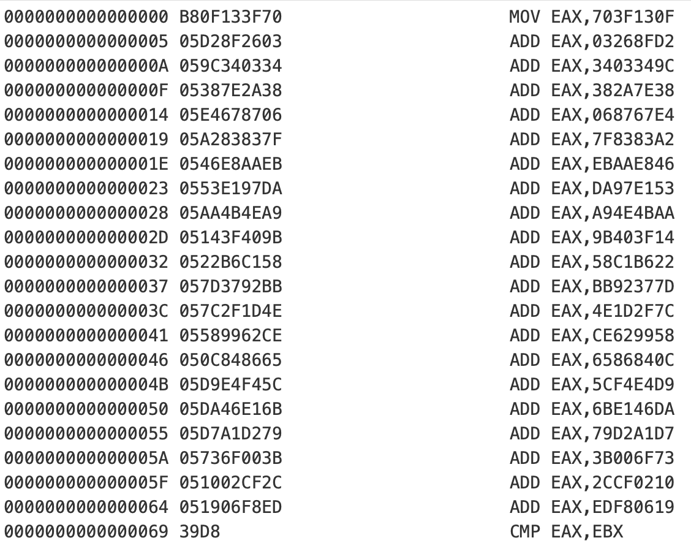

Yes, it is `x86`, Let's use `C#` to disassemble and interpret the bytes we are given.

```c#
BinaryReader bin = new BinaryReader(new MemoryStream(StringToByteArray("b80f133f7005d28f2603059c34033405387e2a3805e467870605a283837f0546e8aaeb0553e197da05aa4b4ea905143f409b0522b6c158057d3792bb057c2f1d4e05589962ce050c84866505d9e4f45c05da46e16b05d7a1d27905736f003b051002cf2c051906f8ed39d8")));
UInt32 EAX = 0;
for (int i = 0; i < 22; i++)
{
    byte opcode = bin.ReadByte();
    if (opcode == 0xB8) //MOV
    {
        EAX = bin.ReadUInt32();
    }
    else if (opcode == 0x05) //ADD
    {
        EAX += bin.ReadUInt32();
    }
}
Console.WriteLine("0x" + EAX.ToString("x2"));

static byte[] StringToByteArray(string hex) 
    => Enumerable.Range(0, hex.Length)
           .Where(x => x % 2 == 0)
           .Select(x => Convert.ToByte(hex.Substring(x, 2), 16))
           .ToArray();
```

Let's get the output and write it there.

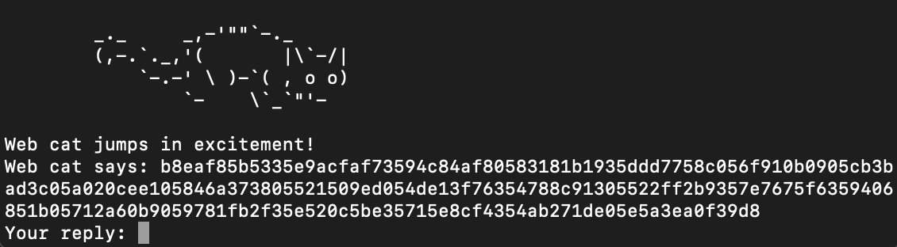

Ah, we got different message with different bytes, Let's disassemble it one more time using `CyberChef`

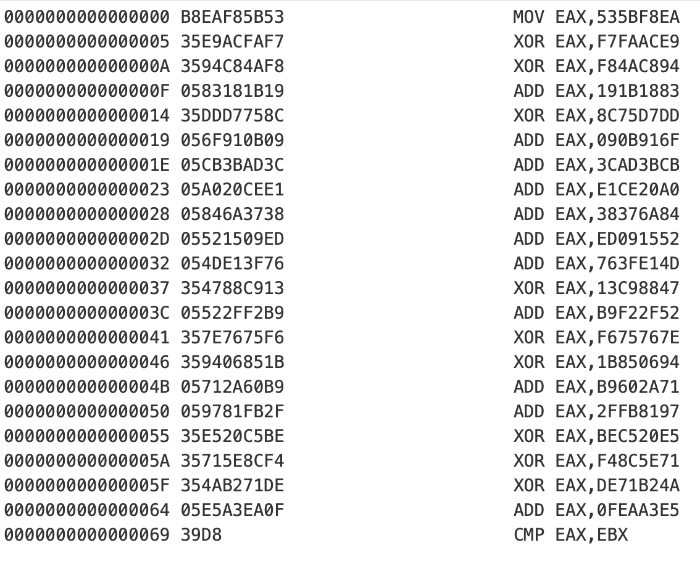

Mhmm, We got more opcodes, its fine let's add it to our code.

```c#
else if (opcode == 0x35) //XOR
{
    EAX ^= bin.ReadUInt32();
}
```

Let's run it again with the new given bytes and submit the output.

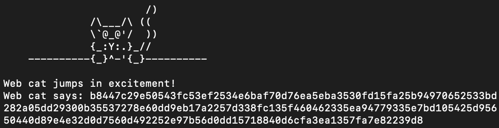

I see, there is another different message and bytes. Let's try our `Bae CyberChef`

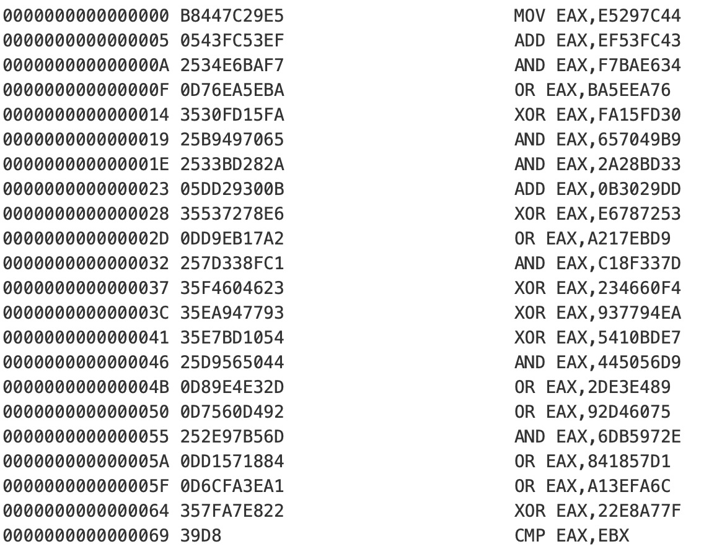

Duh, more and more opcodes, easy let's add them to our code.
```c#
else if (opcode == 0x25) //AND
{
    EAX &= bin.ReadUInt32();
}
else if (opcode == 0x0d) //OR
{
    EAX |= bin.ReadUInt32();
}
```
Let's try it again with the new given bytes.

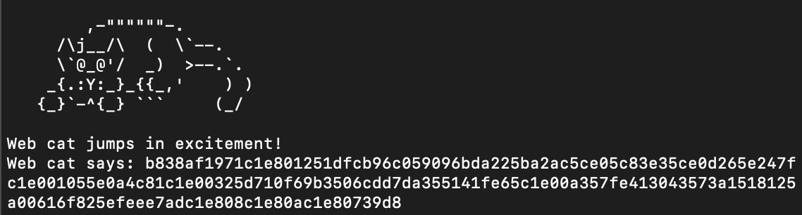

Looks like this is endless? /shrug

Once again let's use `CyberChef` and disassemble the given bytes.

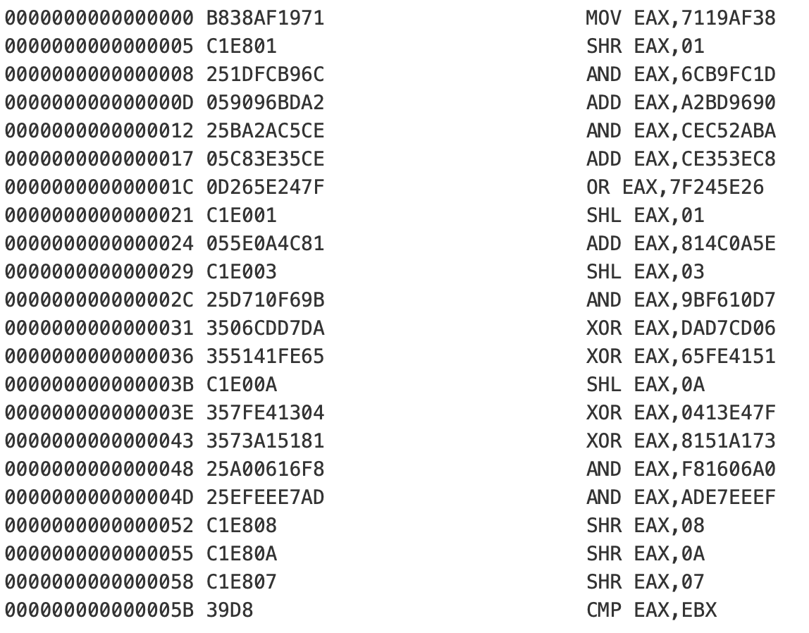

Alright, More opcodes...\
Let's add them to our code.
```c#
else if (opcode == 0xc1) //Shifting
{
    opcode = bin.ReadByte();
    if (opcode == 0xe8)
        EAX >>= bin.ReadByte();
    else if (opcode == 0xe0)
        EAX <<= bin.ReadByte();
}
```

Let's run the code with the new given bytes. Hopefully now we get the flag...

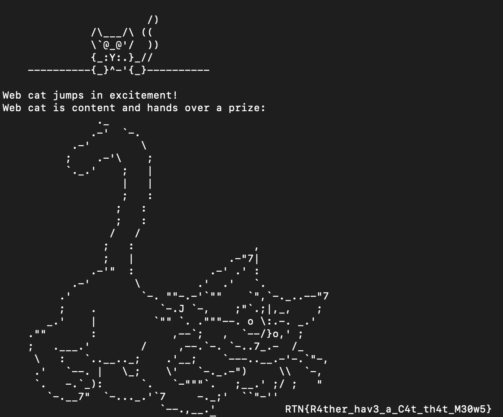

Yay finally we got the flag: `RTN{R4ther_hav3_a_C4t_th4t_M30w5}`

Final Code

```c#
BinaryReader bin = new BinaryReader(new MemoryStream(StringToByteArray(Console.ReadLine())));
UInt32 EAX = 0;
for (int i = 0; i < 22; i++)
{
    byte opcode = bin.ReadByte();
    if (opcode == 0xB8) //MOV
    {
        EAX = bin.ReadUInt32();
    }
    else if (opcode == 0x05) //ADD
    {
        EAX += bin.ReadUInt32();
    }
    else if (opcode == 0x35) //XOR
    {
        EAX ^= bin.ReadUInt32();
    }
    else if (opcode == 0x25) //AND
    {
        EAX &= bin.ReadUInt32();
    }
    else if (opcode == 0x0d) //OR
    {
        EAX |= bin.ReadUInt32();
    }
    else if (opcode == 0xc1) //Shifting
    {
        opcode = bin.ReadByte();
        if (opcode == 0xe8)
            EAX >>= bin.ReadByte();
        else if (opcode == 0xe0)
            EAX <<= bin.ReadByte();
    }
}
Console.WriteLine("0x" + EAX.ToString("x2"));
```