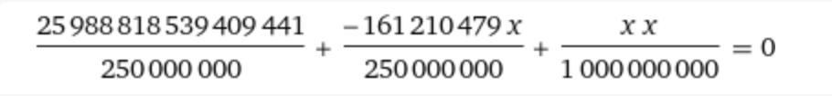
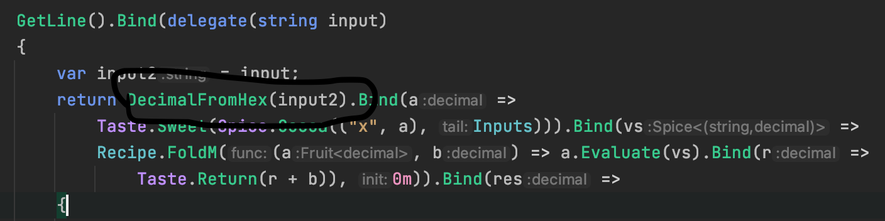

**lambdastic**
==========
**Tools used:** `Dsnpy and C#`\
**Flag:** `RTN{1n_Th3_N4m3_0f_m4p_f1lt3r_and_f0ld_Amen}`\
**Challenge Points:** `700`\
**Challenge Message:**
```
I heard you liked Monads.
```
**Let's get into it**
==========

This challenge is pretty awful because of the monads.
Let's use `Dnspy` to get the source out.


As you can see this is really awful :yikes:\
anyway let's get into this challenge how can we solve it?
As we can see its calling `SafeDiv` multiple times let's have a look at that function.

```c#
private static Taste<decimal> SafeDiv(decimal a, decimal b)
{
    if (b == 0m) return Taste.Bitter<decimal>();
    return Taste.Sweet(a / b);
}
```

Okay so its dividing `a` with `b`, let's get all the `a` and `b` value by printing it out.

```c#
private static Taste<decimal> SafeDiv(decimal a, decimal b)
{
    Console.WriteLine($"SafeDiv {a} / {b} = {a/b}");
    if (b == 0m) return Taste.Bitter<decimal>();
    return Taste.Sweet(a / b);
}
```

input
```c#
345465
```
we get the multiple lines of output
```c#
SafeDiv 11761312493529 / 1000000000 = 11761.312493529
SafeDiv -552867629889483 / 250000000 = -2211470.519557932
SafeDiv 25988818539409441 / 250000000 = 103955274.157637764
```
Let's try to simplify it.
```c#
x = unknown
r = (x * x) / 1000000000
n = (-161210479 * x) / 250000000
s = 103955274.157637764

y = r + n + s //should be 0
```

as you can see `a` is unknown, its a simple math we have only 1 unknown value



So the result is `322420958`, let's go back to the challenge and see it takes our input and convert it from hex so we need to change our output to hex



Let's google `322420958 to hex`


alright let's run the challenge and write `1337C0DE` for the input.


Here we go! `RTN{1n_Th3_N4m3_0f_m4p_f1lt3r_and_f0ld_Amen}`