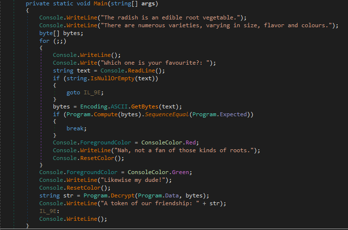
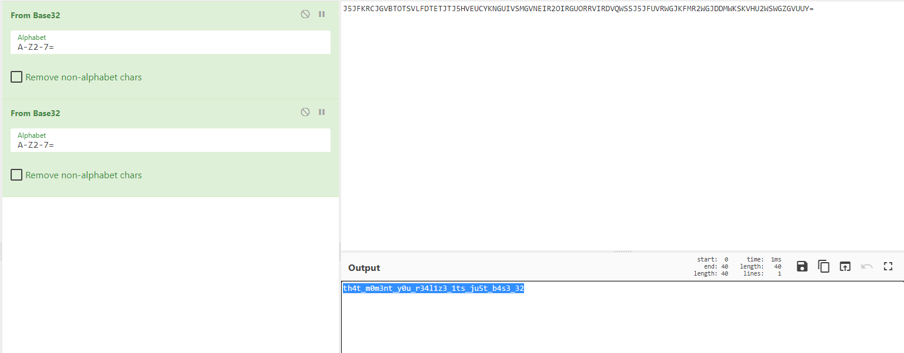

**radish**
==========
**Tools used:** `DnSpy, C# and CyberChef`\
**Flag:** `RTN{th4t_m0m3nt_y0u_r34l1z3_1ts_ju5t_b4s3_32}`\
**Challenge Points:** `300`\
**Challenge Message:**
```
Radish are roots that are very healthy; 
they provide a good base for a delicious smoothie! Which one is your favourite?
```
**Let's get into it**
==========
This is a `.NET` Challenge so let's use `Dnspy` to decompile the challenge.



Honestly i never did read all the code in this challenge, i immediately tried to
use the same way it computes the user input, so instead of the user input i gave it the expected data.

Just like this
```c#
Console.WriteLine(string.Join("", Compute(Expected).Select(x => (char)x)));
``` 

Ok, we got base32 output 
```
J5JFKRCJGVBTOTSVLFDTETJTJ5HVEUCYKNGUIVSMGVNEIR2OIRGUORRVIRDVQWSSJ5JFUVRWGJKFMR2WGJDDMWKSKVHU2WSWGZGVUUY=
```



It uses base32 twice! But here we go, the flag is `RTN{th4t_m0m3nt_y0u_r34l1z3_1ts_ju5t_b4s3_32}`