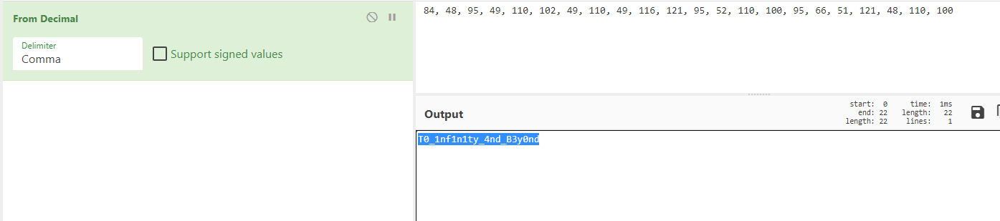
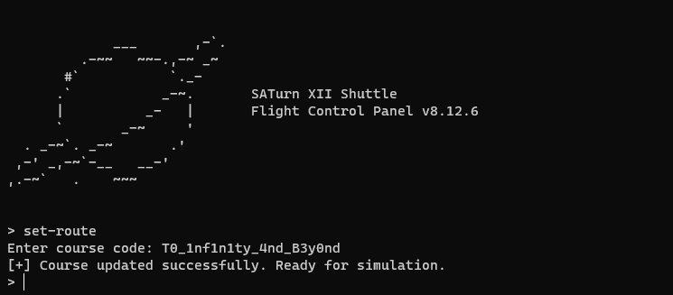

**saturn**
==========
**Tools used:** `IDA, Python and CyberChef`\
**Flag:** `RTN{4r3_y0u_SATisf13d}`\
**Challenge Points:** `600`\
**Challenge Message:**
```
March 12, 2205

Our expediction with the SATurn XII to the Smoo-T48 system proved to be very fruitful. 
Lots of great planets rich with useful minerals!

We must set course back to Earth immediately and report our findings, 
but we ran into a snag. Our automatic navigation system is broken. 
As annoying as it is, we have to resort to the manual navigation system,
but it has been years since I have done this. 
I know my formulae are right, 
I just can't seem to find the solution that doesn't 
result in us colliding with some random asteroid or planet in the simulations...
```
**Let's get into it**
==========
This challenge was built in native, let's run it and see what do we need to do?


After looking at it for a bit, i figured that we need to set a correct route to get the flag.
Let's decompile it using IDA and see how do we get the correct route.


After analyzing the file and reading the decompiled code i found this interesting function, Let's see if there is any other function calls this one. By pressing `X` on the function name, it will show you this dialog.


As we can see there is actually one function calls it, let's jump into it.


Alright, so this function takes our route input and pass it into the other function and compares it to the expected values.
Let's see what is the expected bytes.


this is the expected bytes.
```
0x62, 0x75, 0x4E, 0x77, 0x1F, 0x61, 0x0F, 0x2C, 0x08, 0x25, 0x39, 0x3B, 0x01, 0x65, 0x65, 0x55, 0x13, 0x5A, 0x6B, 0x34, 0x03, 0x46
```

In this challenge i am actually gonna use `z3` in `python` to solve it!
Let's write a script to solve this challenge in python.

```python
from z3 import *


def check(vars):
    for i in range(0,26):
        if (vars[i] ^ vars[(i+1)%26] ^ vars[(i+2)%26] ^ vars[(i+3)%26] ^ vars[(i+4)%26] ^ vars[(i+5)%26] != keys[i]):
            return False
    return True

keys = [ 0x62, 0x75, 0x4E, 0x77, 0x1F, 0x61, 0x0F, 0x2C, 0x08, 0x25, 0x39, 0x3B, 0x01, 0x65, 0x65, 0x55, 0x13, 0x5A, 0x6B, 0x34, 0x03, 0x46 ]
vars = []
s = Solver()

for i in range(0, len(keys)):
    vars.append(BitVec(str(i),7))

s.add(vars[0] ^ vars[6] ^ vars[0xc] ^ vars[0x11] == 0x62) #done
s.add(vars[0x12] ^ vars[1] ^ vars[4] ^ vars[5] ^ vars[0xb] ^ vars[0xc] ^ vars[0xf] == 0x75) #done
s.add(vars[0x15] ^ vars[3] ^ vars[6] ^ vars[8] ^ vars[10] ^ vars[0xb] ^ vars[0xc] ^ vars[0xd] ^ vars[0xf] ^ vars[0x10] ^ vars[0x11] ^ vars[0x12] ^ vars[0x13] == 0x4E) #done
s.add(vars[0x12] ^ vars[0] ^ vars[5] ^ vars[0xc] ^ vars[0xe] ^ vars[0xf] ^ vars[0x11] == 0x77) #done
s.add(vars[0x15] ^ vars[0] ^ vars[3] ^ vars[5] ^ vars[6] ^ vars[8] ^ vars[0xb] ^ vars[0xd] ^ vars[0xe] ^ vars[0xf] ^ vars[0x10] ^ vars[0x13] == 0x1F) #done
s.add(vars[0x15] ^ vars[0] ^ vars[1] ^ vars[2] ^ vars[4] ^ vars[6] ^ vars[7] ^ vars[8] ^ vars[0xb] ^ vars[0xc] ^ vars[0xe] ^ vars[0xf] ^ vars[0x14] == 0x61) #done
s.add(vars[0x15] ^ vars[0] ^ vars[1] ^ vars[2] ^ vars[4] ^ vars[6] ^ vars[7] ^ vars[8] ^ vars[0xb] ^ vars[0xc] ^ vars[0xd] ^ vars[0xe] ^ vars[0xf] ^ vars[0x14] == 0x0F) #done
s.add(vars[0x15] ^ vars[4] ^ vars[5] ^ vars[8] ^ vars[10] ^ vars[0xb] ^ vars[0xe] ^ vars[0x11] == 0x2C) #done
s.add(vars[0x15] ^ vars[0] ^ vars[3] ^ vars[4] ^ vars[5] ^ vars[6] ^ vars[8] ^ vars[0xb] ^ vars[0xd] ^ vars[0xe] ^ vars[0xf] ^ vars[0x10] ^ vars[0x12] ^ vars[0x13] == 0x08) #done
s.add(vars[0x11] ^ vars[1] ^ vars[5] ^ vars[9] ^ vars[0xc] == 0x25) #done
s.add(vars[0x15] ^ vars[0] ^ vars[1] ^ vars[2] ^ vars[3] ^ vars[4] ^ vars[5] ^ vars[6] ^ vars[7] ^ vars[0xb] ^ vars[0xe] ^ vars[0x10] ^ vars[0x12] == 0x39) #done
s.add(vars[0x15] ^ vars[0] ^ vars[3] ^ vars[4] ^ vars[9] ^ vars[10] ^ vars[0xb] ^ vars[0xc] ^ vars[0xd] ^ vars[0xe] ^ vars[0x10] ^ vars[0x11] ^ vars[0x12] ^ vars[0x13] == 0x3B) #done
s.add(vars[0x12] ^ vars[0] ^ vars[7] ^ vars[9] ^ vars[10] ^ vars[0xb] ^ vars[0xc] ^ vars[0xd] ^ vars[0xe] ^ vars[0xf] ^ vars[0x10] ^ vars[0x11] == 0x01) #done
s.add(vars[0x14] ^ vars[0] ^ vars[2] ^ vars[4] ^ vars[5] ^ vars[8] ^ vars[9] ^ vars[0xc] ^ vars[0xe] ^ vars[0xf] ^ vars[0x10] == 0x65) #done
s.add(vars[8] ^ vars[0] == 0x65) #done
s.add(vars[0x15] ^ vars[7] ^ vars[8] ^ vars[0xb] ^ vars[0xd] ^ vars[0xe] ^ vars[0x10] ^ vars[0x12] == 0x55) #done
s.add(vars[0x15] ^ vars[0] ^ vars[5] ^ vars[0xc] ^ vars[0xe] ^ vars[0xf] ^ vars[0x11] ^ vars[0x12] == 0x13) #done
s.add(vars[0x10] ^ vars[4] ^ vars[8] ^ vars[10] ^ vars[0xc] ^ vars[0xd] ^ vars[0xe] == 0x5A) # done
s.add(vars[0x15] ^ vars[0] ^ vars[1] ^ vars[5] ^ vars[6] ^ vars[7] ^ vars[8] ^ vars[9] ^ vars[0xb] ^ vars[0xd] ^ vars[0xe] ^ vars[0x10] == 0x6B) #done
s.add(vars[0x10] ^ vars[0] ^ vars[1] ^ vars[3] ^ vars[4] ^ vars[5] ^ vars[7] ^ vars[8] ^ vars[9] ^ vars[0xb] ^ vars[0xf] == 0x34) #dopne
s.add(vars[0x14] ^ vars[1] ^ vars[2] ^ vars[4] ^ vars[6] ^ vars[7] ^ vars[8] ^ vars[9] ^ vars[10] ^ vars[0xb] ^ vars[0xc] ^ vars[0xe] == 0x03) #done
s.add(vars[0x15] ^ vars[0] ^ vars[2] ^ vars[5] ^ vars[7] ^ vars[8] ^ vars[9] ^ vars[10] ^ vars[0xb] ^ vars[0xd] ^ vars[0xe] ^ vars[0xf] ^ vars[0x12] ^ vars[0x14] == 0x46) #done


print(s.check())
print(s.model())
``` 

Let's run the script with this command

```bash
python3 solve.py
```

we get this output


Let's sort it.

```
84, 48, 95, 49, 110, 102, 49, 110, 49, 116, 121, 95, 52, 110, 100, 95, 66, 51, 121, 48, 110, 100
```

And now let's use `CyberChef` to convert it to ascii.



Alright so our route should be `T0_1nf1n1ty_4nd_B3y0nd`

Let's give it a try.



Ok, we did set our route to `T0_1nf1n1ty_4nd_B3y0nd`, But where is the flag?
Let's try to `simulate` then `go` and then check the `window`.

`simulate`


`go`


`window`


Here you go! the flag is `RTN{4r3_y0u_SATisf13d}`